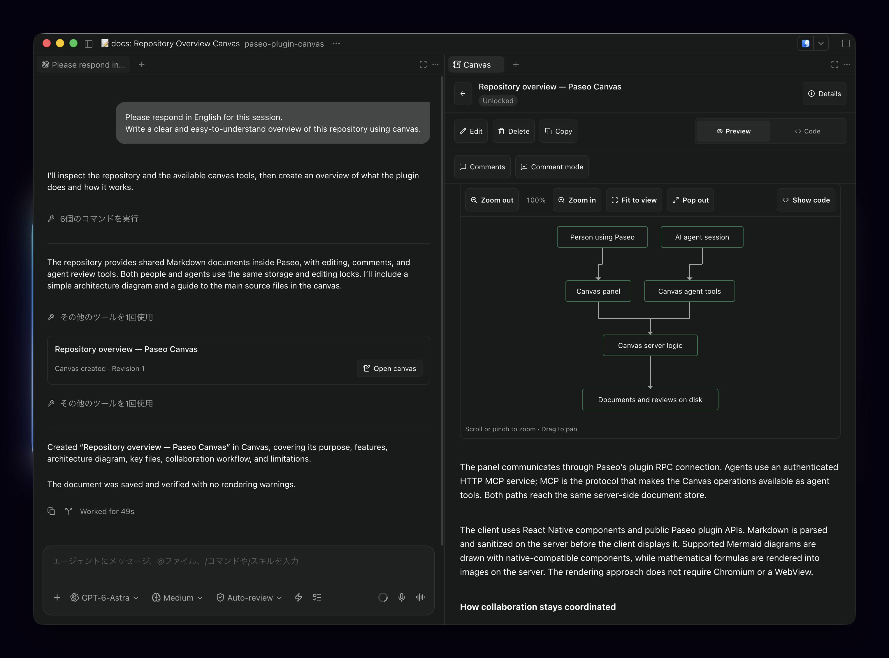
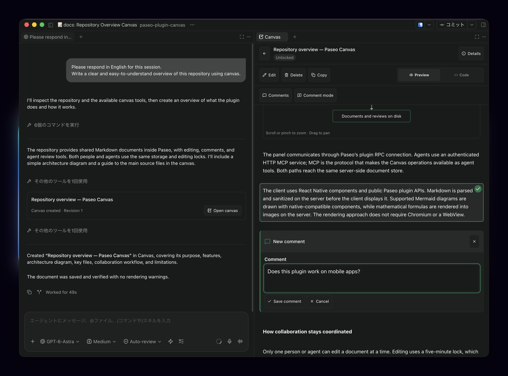
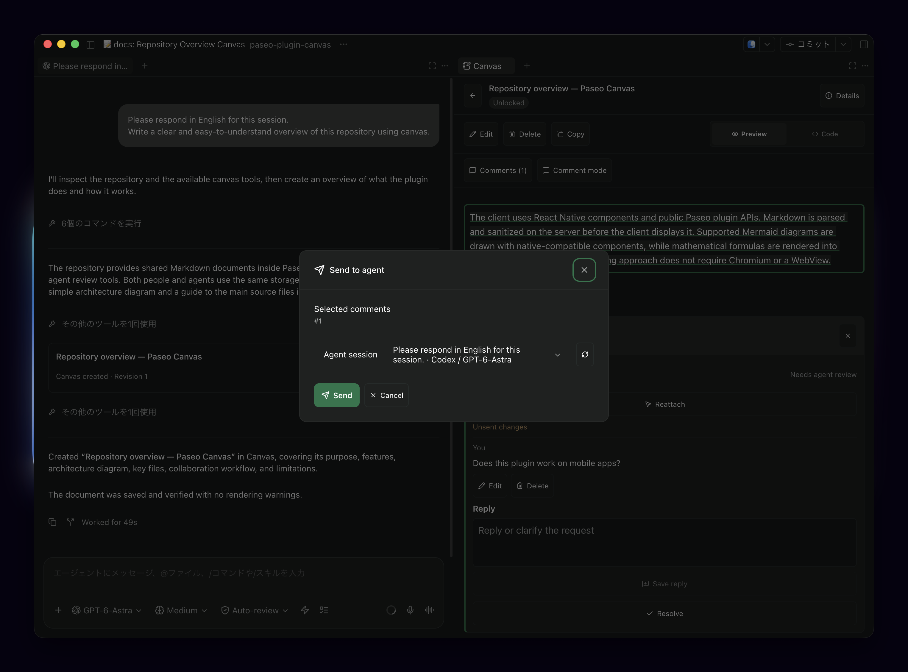
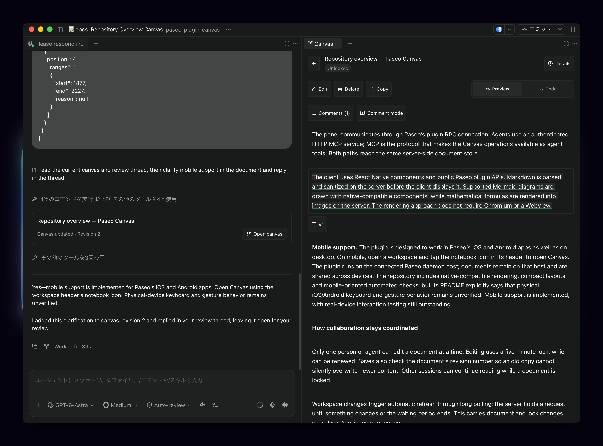

# paseo-canvas

**Write, review, and share Markdown documents with agents in your Paseo workspace.**

Keep plans, notes, and review discussions in one place. Ask an agent to write a document, edit it yourself, and send comments back for another pass. Other agents in the same workspace can read and update the same canvas, even in separate sessions.

[Get started](#get-started) · [Usage](#usage) · [Supported content](#supported-content) · [Troubleshooting](#troubleshooting)




|Create a Canvas|Comment|Send to Agent|Agent gives feedback|
|---|---|---|---|
|  |  |  |  |


## What you can do

- **Share documents across sessions.** Keep multiple canvases in a workspace, with changes appearing automatically.
- **Write with an agent or on your own.** Create, edit, preview, and delete Markdown documents directly in Paseo.
- **Review in context.** Comment on paragraphs, tables, diagrams, or several blocks together, then send selected discussions to an agent.
- **Keep edits coordinated.** See who is editing. Only one user or agent can edit a document at a time, while everyone else can keep reading.
- **Keep your project directory clean.** Saved canvases live on the Paseo daemon host and survive restarts.

## Get started

### Requirements

- **Paseo 0.8.0 or later**, with plugins enabled on the host where your agents run.
- **Node.js 22.22+** and **npm 11+** installed on that host.
- For agent access, an agent provider that supports **HTTP MCP**, the connection used to expose Canvas tools to agents.

### Install

In Paseo, open **Settings → Plugins** on the target host and turn on **Enable plugins** if needed. On Paseo 0.9.0-beta.1 or later, paste this source into **Plugin source**, then select **Install plugin**:

```text
npm:paseo-canvas
```

Alternatively, install from a terminal on the daemon host:

```sh
paseo plugin install npm:paseo-canvas
```

This installs the latest release of the [npm package](https://www.npmjs.com/package/paseo-canvas). To follow the `main` branch instead, use the `github:supermomonga/paseo-plugin-canvas` source. Paseo 0.8.0 cannot install npm packages; use `https://github.com/supermomonga/paseo-plugin-canvas` in either method.

Paseo installs dependencies automatically. Git installations also build the rendering assets on the host. Confirm that `paseo-canvas` is running in **Settings → Plugins**. See the [Paseo plugin guide](https://paseo.sh/docs/plugins) for installation details.

> [!IMPORTANT]
> Create a **new agent after installing or enabling the plugin** to give it Canvas access. Existing agents and imported sessions do not receive Canvas tools automatically. Agents created with Canvas enabled retain their access when resumed.

### Open Canvas

Open a workspace, then choose **Open Canvas** from the Command Center (**⌘K** on macOS, **Ctrl+K** on Windows/Linux). On iOS and Android, use the notebook icon in the workspace header.

### Update

Run this on the daemon host:

```sh
paseo plugin update paseo-canvas
```

npm installations update to the latest release. Git installations update to the latest `main`.

> [!WARNING]
> Upgrading from the earlier version 1 storage format requires manual conversion of canvas metadata. Back up Canvas storage before upgrading; there is no automatic migration. Old version 1 review comments are unsupported and are replaced when a new comment is saved.

## Usage

### Create and share a document

Choose **New canvas**, enter a title and Markdown content, then press **Save**. Switch between **Preview** to read the document and **Code** to inspect or copy its Markdown.

You can also ask a Canvas-enabled agent:

> Create a canvas named “Implementation plan” with the proposed changes and a verification checklist.

Then ask another agent in the **same workspace**:

> Read the “Implementation plan” canvas and review it for missing steps.

Agent saves add a timeline notification with an **Open canvas** button. It opens the latest saved document, so you can return to the work directly from the conversation.

### Edit a document

Choose **Edit** to start editing. **Preview** shows your unsaved draft, and **Markdown** returns to the input. **Save** commits your changes and releases the edit lock. **Cancel** leaves the saved document unchanged and asks for confirmation before discarding edits.

If someone else is editing, you can keep reading the latest saved version. Edit locks last five minutes and renew automatically while the editor is active.

> [!NOTE]
> Drafts are kept in memory. Switching between preview and editing keeps them, but closing the app loses unsaved changes.

**Delete** asks you to confirm the canvas title before permanently removing the document and all its comments.

### Send review comments to an agent

1. Choose **Comment mode** and select one or more blocks in the document.
2. Press **Add comment**, write your feedback, and save it. A single discussion covers all selected blocks.
3. Press **Send** on a comment card. To send several discussions together, mark them with **Select for sending**, then press **Send to agent**.
4. Choose an **Agent session** and press **Send**.
5. Read the agent's questions or change reports in the discussion. Use **Resolve** when you are satisfied, or **Reopen** to continue.

Saving a comment does **not** send a prompt: you choose what to send and when. Sending to a running agent can interrupt its current work. If it has a pending permission request, handle that in Paseo first.

Use **Comments** to browse discussions and **Go to target** to return to the relevant passage. Comments follow document edits where their location remains clear. If a comment becomes **Outdated**, its original quote is preserved; use **Reattach** to select a new target.

Only Canvas-enabled sessions in the same workspace appear as recipients. Refresh the **Agent session** picker to pick up session changes.

## Supported content

| Content | What to expect |
| --- | --- |
| Markdown | Headings, lists, quotes, links, tables, strikethrough, code blocks, and read-only task lists. |
| GitHub-style extras | Note and warning alerts, footnotes, emoji shortcodes, and heading links. |
| Images | HTTP/HTTPS images and workspace-relative PNG, JPEG, GIF, and WebP files. Local images must be at most 5 MB; symlinks and paths outside the workspace are rejected. |
| Mathematics | Inline and block TeX formulas. |
| Mermaid diagrams | A subset of flowcharts and sequence diagrams, with zoom, pan, and expanded views. |
| Embedded HTML | Collapsible `details`/`summary`, line breaks, subscript, and superscript. Other raw HTML appears as text; scripts do not run. |

**Full Mermaid syntax is not supported.** Use one declaration or connection per line. Subgraphs, styling directives, and sequence blocks such as `loop` and `alt` are unsupported. If a diagram cannot render, Canvas shows its source and an explanation; agent saves also return feedback to help correct it.

Standalone HTML documents and syntax highlighting in Code view are not supported. External images load from their original hosts when viewed.

## Where your documents are saved

Canvases and reviews are stored on the **machine running the Paseo daemon**, outside your project:

| Host OS | Storage location |
| --- | --- |
| macOS | `~/Library/Application Support/paseo-canvas` |
| Linux | `$XDG_DATA_HOME/paseo-canvas` when set to an absolute path; otherwise `~/.local/share/paseo-canvas` |
| Windows | `%LOCALAPPDATA%\paseo-canvas` |

Data is separated by Paseo home and workspace. Saved documents survive restarts and workspace archival. Back up this storage directory to preserve your canvases and reviews. Moving `PASEO_HOME` also requires moving its associated Canvas data and connection state. Network shares and editing stored files externally while the plugin runs are unsupported.

## Troubleshooting

| Problem | What to do |
| --- | --- |
| Canvas does not appear | Check **Settings → Plugins** on the correct host and confirm that the plugin is enabled and running. On mobile, use the workspace header's notebook icon. |
| An agent cannot find Canvas tools | Create a new agent after installation. Confirm that its provider supports HTTP MCP; custom providers must forward Paseo's MCP configuration. |
| An agent is missing from the recipient list | Use a Canvas-enabled session in the same workspace and refresh the **Agent session** picker. |
| Editing is locked | Wait for the current editor to save or cancel, or for its five-minute lock to expire. |
| Your edit lock was lost | Try **Reacquire lock**. If the saved document has changed, copy your draft before cancelling and reviewing the latest version. |
| A save or send has an uncertain outcome | Check the saved document or recipient session before retrying. The operation may already have succeeded; retrying can create duplicates. |
| A diagram will not display | Read the explanation and simplify it to the supported Mermaid subset. |
| The plugin fails to start | Inspect its **Logs** in Settings → Plugins, or run `paseo plugin logs paseo-canvas`. Check storage permissions and whether its saved MCP port is occupied. |
| A timeline notification is missing | Keep a Paseo client active for delivery. Paseo 0.8.0 does not retain delivered plugin rows across daemon restarts; open the document from Canvas instead. |

> [!NOTE]
> Physical iOS/Android keyboard and gesture behavior, Claude/OpenCode connections, and Linux/Windows storage durability remain unverified. Windows environments without directory synchronization support cannot use this storage implementation.

## Acknowledgments

Canvas uses [paseo-plugin-helper](https://github.com/xpufx/paseo-plugin-helper) for shared UI components and utilities, and adapts diagram rendering from [paseo-plugin-mermaid](https://github.com/dutchakdev/paseo-plugin-mermaid). See the [Mermaid attribution](third-party/paseo-plugin-mermaid/README.md) and [bundled font attribution](server/assets/README.md).
