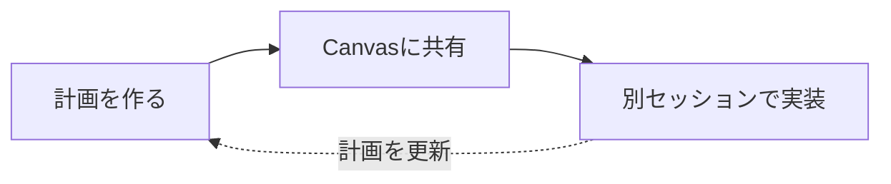
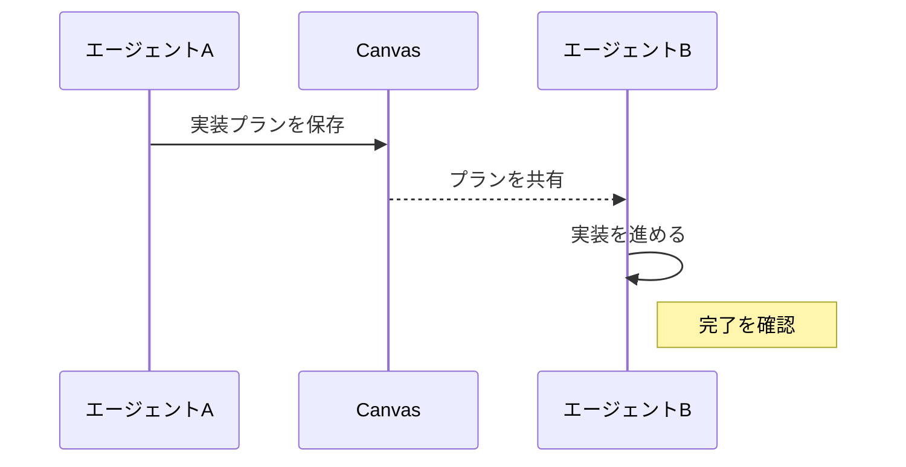
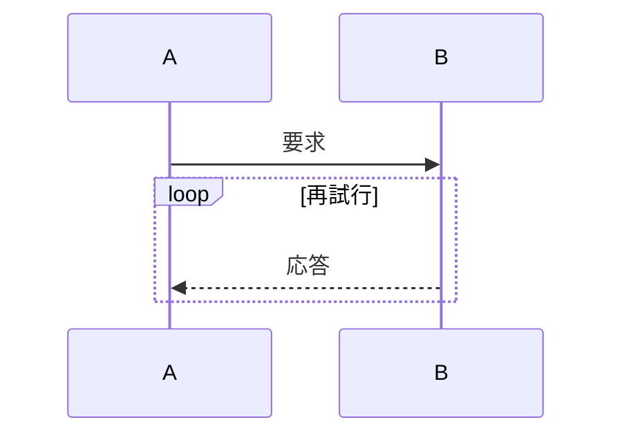

# Markdown表示の確認

[脚注へ](#footnote-label) · [折りたたみ内の見出しへ](#詳細な根拠) · [**装飾付き**リンク](https://example.com)

通常の文章、**太字と *斜体***、~~取り消し線~~、`<literal> &amp;`、:sparkles: :+1:。
この行は同じ段落として続きます。  
ここは明示的な改行です。<br>HTMLの改行にも対応します。H<sub>2</sub>O と x<sup>2</sup>。

> [!NOTE]
> 読むときに役立つ補足です。**強調**と[リンク](https://example.com)も使えます。

> [!TIP]
> - 完了条件を先に整理します。
> - [x] タスク内でも表示を確認

> [!IMPORTANT]
> セッション間で同じCanvasを共有します。
>
> 複数段落の内容も保持します。

> [!WARNING]
> 編集ロックの期限を確認してください。

> [!CAUTION]
> 削除した内容は復元できません。

## 表とリスト

| キャラクター | 主な関係 |
|:---|:---|
| 鹿目まどか | 全ての中心。ほむらに執着され、さやかの親友、マミの後輩 |
| 暁美ほむら | まどかを守るため時間遡行を繰り返す。キュゥべえと敵対 |

> | 項目 | 説明 |
> |:---|:---|
> | 引用内の表 | 引用の余白を除いた幅に合わせて表示します。 |

| 左揃え | 中央揃え | 右揃え |
|:---|:---:|---:|
| **太字**と `code` | [リンク](https://example.com) | 123 |
| 長い日本語の文を折り返して表示します | ~~旧案~~ | 456 |
| エスケープした \| | :rocket: | 789 |

9. 番号の開始値を維持
10. 複数桁の番号でも本文を揃える
    - [x] 完了したタスク
    - [ ] 未完了のタスク

    同じ項目の追加段落です。

    > 入れ子の引用
    >
    > > さらに深い引用

## 図と数式







文中の数式 $E=mc^2$ と $\frac{a}{b}$ を表示します。

$$
\sum_{i=1}^{n} i = \frac{n(n+1)}{2}
$$

```math
\int_0^1 x^2\,dx = \frac{1}{3}
```

```typescript
const content = await canvas.get(id);
console.log(content);
```

## 画像


<details>
<summary>詳細な根拠</summary>

### 詳細な根拠

折りたたみ内でも **Markdown** を表示します。参照リンクから開くこともできます。

- 根拠を確認
- 結果を共有

</details>

<details open>
<summary>初期状態で開いている補足</summary>

この折りたたみも閉じられます。

</details>

## 脚注の参照

調査結果には出典を付けます[^source]。同じ脚注を再度参照できます[^source]。

[^source]: 補足の最初の段落。[出典](https://example.com)

    脚注の追加段落です。

<!-- このコメントはプレビューに表示しません。 -->

## 同じ見出し

[次の同名見出しへ](#同じ見出し-1)

## 同じ見出し

重複する見出しにも一意の移動先を付けます。
